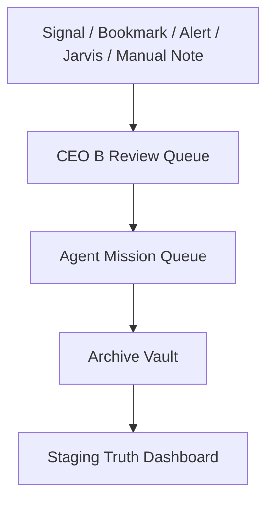

# Pickaxe Capital / AI Habitat OS

Pickaxe Capital is the public brand. AI Habitat OS is the internal operating system. CEO B is the human manual review and command layer.

This project is a premium dark cyber-finance command center and AI-agent habitat. The immediate goal is to finish a stable, readable, static-first website before adding deeper integrations.

## 🔗 Live Deployments (GitHub Pages)

- **Main Cockpit**: [https://burberrry.github.io/Pickaxe-Capital/](https://burberrry.github.io/Pickaxe-Capital/)
- **Phase 2B Watchlists Review**: [https://burberrry.github.io/Pickaxe-Capital/?v=phase2b-watchlists#/watchlists](https://burberrry.github.io/Pickaxe-Capital/?v=phase2b-watchlists#/watchlists)
- **Vision Map**: [https://burberrry.github.io/Pickaxe-Capital/#/vision-map](https://burberrry.github.io/Pickaxe-Capital/#/vision-map)

---

## 📊 Current Production Status

| Parameter / Milestone | Current Status | Notes |
| :--- | :--- | :--- |
| **Static App Runtime** | **Active** | Served by `server.mjs` locally and static files on GitHub Pages |
| **GitHub Pages** | **Live** | Root/public mirrors support static deployment |
| **Alerts Desk** | **Complete** | Homepage and research review queue |
| **Design System / Living Agent Network** | **Complete** | Phase 1.5 command-center foundation |
| **Premium UI Polish** | **Complete** | Phase 1.6 readability and surface polish |
| **Dashboard** | **Complete** | Pinned `#/dashboard` CEO B overview |
| **Watchlists** | **Built + Pushed + Live-Checked** | Phase 2B commit `e2db5a2` is on `origin/main` |
| **Options Hub** | **Next** | Phase 2C after CEO B approves Watchlists |
| **Real Market Data** | **Future Adapter** | No active provider connection |
| **Broker Execution** | **Not Supported** | Manual review stays outside this site |
| **Backend Integration** | **Optional Later** | Current app is LocalStorage-only |

Phase 2B Watchlists is built, committed, pushed to origin/main, and live-checked by CEO B.

---

## 🔮 Phase 2 Terminal Roadmap

Phase 2 Pickaxe Research Terminal work is being built route-by-route. Dashboard and Watchlists are complete as static prototypes; Options Hub is the next prototype after CEO B approves Watchlists. Current app remains static-first, research-only, no broker execution, no fake live data.

---

## 🎯 What This Website Is

A local-first, browser-sandboxed command center for:
- Market research & options intelligence mapping.
- Agent task and mission queue routing.
- CEO B Review desk packets.
- Simulated alert rule ideation and simulated simulation runs.
- Chrome/X Bookmarks intake & deduplication.
- Intelligence Vault archives.
- System coverage checklists & build status diagnostics.

---

## 🔄 Core Workflow Pipeline



Or in text:
**Signal / Bookmark / Alert / Jarvis / Manual Note** ➔ **CEO B Review Queue** ➔ **Agent Mission Queue** ➔ **Archive Vault** ➔ **Staging Truth Dashboard**

---

## 🛑 What This Website Is Not

- **Not a Brokerage**: It has no broker execution and does not support orders.
- **No Auto-Trading**: Every decision requires manual CEO B review.
- **No Copy-Trading**: The site does not mirror or automate anyone else's actions.
- **No Betting / Sportsbook Execution**: Money Lab remains research-only.
- **No System Shell / Device Control**: Jarvis Lab is a browser prototype command router; it cannot execute shell scripts, terminal commands, or pair hardware device commands.
- **No Web Scraping**: It does not scrape protected sites. Bookmarks utilize offline files loaded via browser `FileReader`.
- **No Fake Live Market Data**: It does not connect to market data providers unless a future adapter is intentionally built.
- **Frontend Safe**: It does not store or accept private API keys in client-side code.

---

## ⏳ Phase Tracker

- **[x] Phase 1.5 — Design System + Living Agent Network**: complete.
- **[x] Phase 1.6 — Premium UI Polish Pass**: complete.
- **[x] Phase 2A — CEO B Dashboard Prototype**: built, committed, and pushed.
- **[x] Phase 2B — Watchlists Prototype**: built, committed, pushed to origin/main, and live-checked by CEO B.
- **[ ] Phase 2C — Options Hub Prototype**: next after CEO B approves Watchlists.

---

## 🚀 Next Priority

- **Phase 2B Watchlists is built, committed, pushed to origin/main, and live-checked by CEO B.**

---

## 🛠️ Quick Start

```bash
git clone https://github.com/Burberrry/Pickaxe-Capital.git
cd Pickaxe-Capital
node server.mjs
```

Open `http://localhost:4328/#/alerts`, `http://localhost:4328/#/dashboard`, or `http://localhost:4328/#/watchlists` in your browser.

Useful validation scripts:
```bash
node scripts/build.mjs
node scripts/check-project.mjs
node scripts/update-readme.mjs
```

## Core Routes

| Route | Purpose |
|---|---|
| `#/dashboard` | CEO B operating overview |
| `#/alerts` | Alerts Desk / research review queue |
| `#/watchlists` | Static research universe |
| `#/vision-map` | Living Agent Network |
| `#/agents` | Agent Engine |
| `#/signals` | Signals Lab |
| `#/source-hub` | Source Hub |
| `#/risk-rules` | Risk & Rules |
| `#/learning-ledger` | Learning Ledger |
| `#/trend-radar` | Trend Radar |
| `#/archive` | Archive Vault |
| `#/bookmarks` | Bookmarks Mine |
| `#/money-lab` | Money Lab |
| `#/staging` | Staging / QA |
| `#/ai-habitat-os` | AI Habitat OS |
| `#/markets` | Markets Matrix future concept |
| `#/options` | Options Hub future / Phase 2C |
| `#/catalysts` | Catalysts Calendar future |
| `#/research` | Research Desk future |
| `#/roadmap` | Build / Roadmap |

## Auto-Updating Game Plan

The section below is refreshed from `AGENTS.md`, `PROJECT_STATUS.md`, and `NEXT_STEPS.md` by running `node scripts/update-readme.mjs`.

<!-- PICKAXE-AUTO-UPDATE:START -->

### Last README Game Plan Update

- Generated: 2026-06-01
- Sources: `AGENTS.md`, `PROJECT_STATUS.md`, `NEXT_STEPS.md`

### Working Now

- `#/dashboard`
- `#/alerts`
- `#/mission-control`
- `#/vision-map`
- `#/agents`
- `#/signals`
- `#/source-hub`
- `#/risk-rules`
- `#/learning-ledger`
- `#/trend-radar`
- `#/archive`
- `#/bookmarks`
- `#/money-lab`
- `#/staging`
- `#/ai-habitat-os`
- `#/watchlists`
- `#/markets`
- `#/options`
- `#/catalysts`
- `#/research`
- `#/roadmap`

### Current State

- Alerts Desk remains the homepage and research review queue.
- Dashboard exists as the pinned `#/dashboard` CEO B operating overview.
- Watchlists exists as `#/watchlists` and is the Phase 2B research universe foundation.
- Vision Map carries the Living Agent Network.
- Routes 16-20 remain future concepts except where explicitly upgraded later.
- The app is static-first, vanilla JS / HTML / CSS, and LocalStorage-only.
- No backend, live provider data, broker execution, auto-trading, betting/sportsbook execution, copy-trading, fake live data, private URLs, or frontend API keys are connected.

### Next Priority

- Keep Watchlists stable.
- Do not change Watchlists unless a visible bug is found.
- Continue preserving research-only wording and static GitHub Pages safety.

### Non-Negotiable Build Rules

- Never delete working pages without asking.
- Do not rebuild from scratch unless explicitly asked.
- Do not duplicate pages; merge duplicate ideas into the stronger page.
- Reuse components before creating new ones.
- No duplicate data/component/page concepts.
- Mock data must be labeled.
- No fake live integrations.
- No scraping or bypassing protected sites.
- Use safe external-source fallbacks.
- Keep design dark, premium, cyberpunk, readable, and Pickaxe Capital branded.

<!-- PICKAXE-AUTO-UPDATE:END -->

## Rule for Future AI/Codex/Antigravity Sessions

1. Read `README.md`, `AGENTS.md`, `PROJECT_STATUS.md`, and `NEXT_STEPS.md` first.
2. Do not rebuild from scratch.
3. Work on the next highest-priority item only.
4. Run build/check and verify affected routes.
5. Update status files.
6. Run `node scripts/update-readme.mjs`.
7. Commit finished work.

## GitHub Pages Deployment
Last deployment trigger: 2026-05-31T01:25:00-07:00
