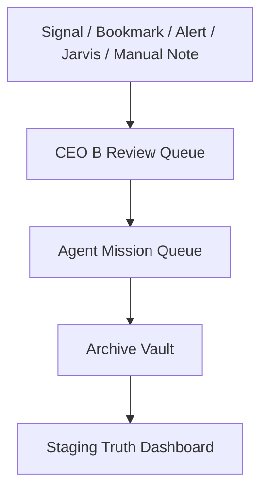

# Pickaxe Capital / AI Habitat OS

Pickaxe Capital is the public brand. AI Habitat OS is the internal operating system. CEO B is the founder decision layer for reviewing, ranking, and approving work.

This project is a premium dark cyber-finance command center and AI-agent habitat. The immediate goal is to finish a stable, readable, static-first website before adding deeper integrations.

## 🔗 Live Deployments (GitHub Pages)

- **Main Cockpit**: [https://burberrry.github.io/Pickaxe-Capital/](https://burberrry.github.io/Pickaxe-Capital/)
- **Vision Map**: [https://burberrry.github.io/Pickaxe-Capital/#/vision-map](https://burberrry.github.io/Pickaxe-Capital/#/vision-map)

---

## 📊 Current Production Status

| Parameter / Milestone | Current Status | Notes |
| :--- | :--- | :--- |
| **Static App Runtime** | **Active** | Served locally via `server.mjs` & static on GitHub Pages |
| **Session 01 (Jarvis & Workflow)** | **Done + Pushed** | Local command router and dispatch pipelines locked |
| **Session 02 (Visual Upgrade)** | **Done + Pushed** | Obsidian/fintech visually polished, **Commit `7b7968b`** |
| **GitHub Pages Hosting** | **Live** | Maintained static file mirrors at root |
| **Real Market Data** | **Future Adapter** | Conceptual providers catalog; no active billing hooks |
| **Broker / Trade Execution** | **Not Supported** | Local research logging only; manual broker review stays outside this site |
| **Backend Integration** | **Optional Later** | LocalStorage keys drive state sandbox completely |

Latest live verification confirms the Citadel Intelligence Center Alerts Desk is deployed and stable.

---

## 🔮 Phase 2 Terminal Roadmap

Phase 2 Webull-inspired Pickaxe Research Terminal is planned as future documentation and wireframes only. It is not implemented yet. Current app remains static-first, research-only, no broker execution, no fake live data.

---

## 🎯 What This Website Is

A local-first, browser-sandboxed command center for:
- Market research & options intelligence mapping.
- Agent task and mission queue routing.
- CEO B Review desk packets.
- Simulated alert rule ideation and simulated simulation runs.
- Chrome/X Bookmarks intake & deduplication.
- Intelligence Vault archives.
- System coverage checklists & build status diagnostics.

---

## 🔄 Core Workflow Pipeline



Or in text:
**Signal / Bookmark / Alert / Jarvis / Manual Note** ➔ **CEO B Review Queue** ➔ **Agent Mission Queue** ➔ **Archive Vault** ➔ **Staging Truth Dashboard**

---

## 🛑 What This Website Is Not

- **Not a Brokerage**: It has no trading capability, does not place orders, and does not execute broker APIs.
- **No System Shell / Device Control**: Jarvis Lab is a browser prototype command router; it cannot execute shell scripts, terminal commands, or pair hardware device commands.
- **No Web Scraping**: It does not scrape protected sites. Bookmarks utilize offline files loaded via browser `FileReader`.
- **No Live API Calls**: It does not connect to live market data providers unless a future adapter is explicitly connected.
- **Frontend Safe**: It does not store or accept private API keys in client-side code.

---

## ⏳ Session Tracker / Milestones

- **[x] 01 — Jarvis Router & Workflow Lock**: Done + pushed.
- **[x] 02 — Visual Production Upgrade + Options Intelligence Command Center**: Done + pushed (Commit `7b7968b`).
- **[ ] 03 — Signals / Archive / Bookmarks Deep Functionality**: **Next Priority**.
- **[ ] 04 — Source Hub Adapter Readiness**: Waiting.
- **[ ] 05 — Final QA + GitHub Pages Readiness**: Waiting.
- **[ ] 06 — Device Hub / Life OS**: Later.

---

## 🚀 Next Priority

- **Signals / Archive / Bookmarks Deep Functionality Pass**

---

## 🛠️ Quick Start

```bash
git clone https://github.com/Burberrry/Pickaxe-Capital.git
cd Pickaxe-Capital
node server.mjs
```

Open `http://localhost:4328/#/vision-map` or `http://localhost:4328/#/agents` in your browser.

Useful validation scripts:
```bash
node scripts/build.mjs
node scripts/check-project.mjs
node scripts/update-readme.mjs
```

## Core Routes

| Route | Purpose |
|---|---|
| `#/vision-map` | Main command center |
| `#/agents` | AI Habitat OS agent world |
| `#/signals` | Market intelligence workbench |
| `#/archive` | Intelligence vault |
| `#/bookmarks` | Manual bookmark intake |
| `#/source-hub` | External source cockpit |
| `#/staging` | Build tracker, QA, and status |
| `#/founder` | Founder / brand page |
| `#/ceo-b-profile` | CEO B command profile |
| `#/jarvis-lab` | Local command prototype |
| `#/life-os` | Life Habitat prototype |
| `#/ai-handoff` | Copy/paste project handoff |

## Auto-Updating Game Plan

The section below is refreshed from `AGENTS.md`, `PROJECT_STATUS.md`, and `NEXT_STEPS.md` by running `node scripts/update-readme.mjs`.

<!-- PICKAXE-AUTO-UPDATE:START -->

### Last README Game Plan Update

- Generated: 2026-05-31
- Sources: `AGENTS.md`, `PROJECT_STATUS.md`, `NEXT_STEPS.md`

### Working Now

- `/`
- `#/alerts`
- `/agents`
- `/vision-map`
- `/archive`
- `/staging`
- `/founder`
- `/ceo-b-profile`
- `/bookmarks`
- `#/watchlists`
- `#/markets`
- `#/options`

### Current State

- Live URL checked: `https://burberrry.github.io/Pickaxe-Capital/?v=logo2#/alerts`.
- Alerts Desk is live and correct with 20 sidebar items and 20 visible Alerts Desk panels.
- Logo and favicon are improved, cache-busted, and not cropped.
- No stale active wording was found, no code changes were needed in the final verification pass, and validation passed.
- `/` and `#/alerts` now open the Citadel Intelligence Center Alerts Desk with a 20-panel CEO B research review dashboard.
- `/agents` is fully integrated with the AI Habitat OS operating layer, review stacks, and active mission boards.
- `/vision-map` is wired dynamically into the Review and Mission pipelines. Node and agent drawers support stateful actions that push task and review items. Selected agent markers support highlights.
- `/bookmarks` supports manual intake and Chrome/X bookmark batch analy

### Next Priority


### Non-Negotiable Build Rules

- Never delete working pages without asking.
- Do not rebuild from scratch unless explicitly asked.
- Do not duplicate pages; merge duplicate ideas into the stronger page.
- Reuse components before creating new ones.
- No duplicate data/component/page concepts.
- Mock data must be labeled.
- No fake live integrations.
- No scraping or bypassing protected sites.
- Use safe external-source fallbacks.
- Keep design dark, premium, cyberpunk, readable, and Pickaxe Capital branded.

<!-- PICKAXE-AUTO-UPDATE:END -->

## Rule for Future AI/Codex/Antigravity Sessions

1. Read `README.md`, `AGENTS.md`, `PROJECT_STATUS.md`, and `NEXT_STEPS.md` first.
2. Do not rebuild from scratch.
3. Work on the next highest-priority item only.
4. Run build/check and verify affected routes.
5. Update status files.
6. Run `node scripts/update-readme.mjs`.
7. Commit finished work.

## GitHub Pages Deployment
Last deployment trigger: 2026-05-31T01:25:00-07:00
